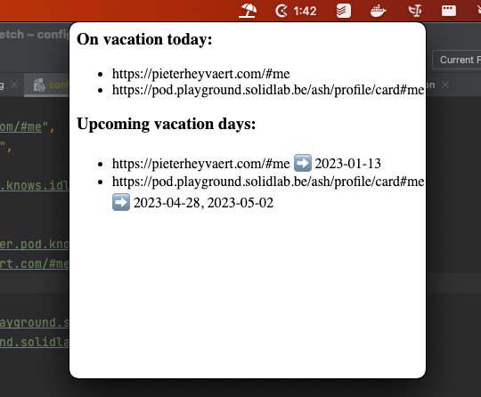

# Solid menubar app example

Important: I didn't clean this code or add any documentation.

## Usage
1. Install dependencies via
   ```shell
   npm i
   ```
2. Copy config.example.json to config.json via
   ```shell
   cp config.example.json config.json
   ```
3. Edit config.json
4. Start app via
   ```shell
   npm start
   ```
   
## Screenshot



## Launch a startup (macOS)

Follow these steps to launch the app a startup in macOS:

1. Copy `be.ugent.vacation.example.plist` to `~/Library/LaunchAgents/be.ugent.vacation.plist`.
2. Update paths to this directory in `~/Library/LaunchAgents/be.ugent.vacation.plist`.
3. Copy `run-launch.example.sh` to `run-launch.sh`.
4. Update the `PATH` variable in `run-launch.sh`.
5. Load app via `launchctl load be.ugent.vacation.plist`.